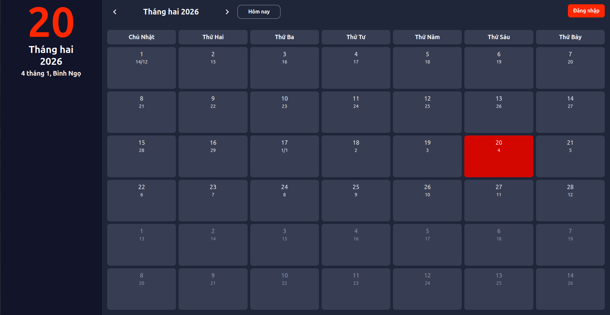
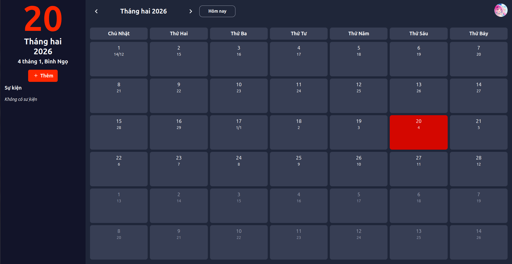
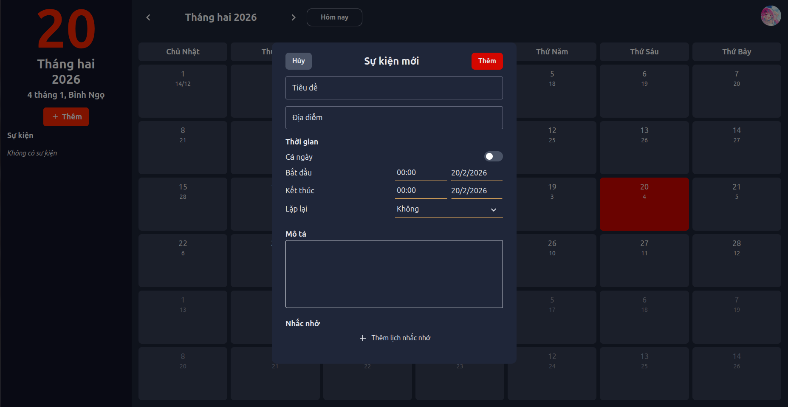

# Lunisolar - A Lunar Calendar App For Vietnamese People
Lunisolar is an application designed to help user keep track of lunar dates, traditional festivals, and important events in the Vietnamese lunar calendar.
The app provides an easy-to-use interface for tracking lunar calendar dates alongside the Gregorian calendar.

## Features
- **Lunar Calendar Integration**: View lunar dates alongside Gregorian dates.
- **Festival Reminders**: Get notifications for important Vietnamese festivals and holidays.
- **Event Management**: Add and manage personal events based on Gregorian or lunar dates.
- **User-Friendly Interface**: Simple and intuitive design for easy navigation.

### Technologies Used
- Frontend: TypeScript, React, Redux, Tailwind CSS.
- Backend: TypeScript, Node.js, Express, MongoDB, GraphQL, Redis.

### Installation
1. Clone the repository:
```bash
git clone https://github.com/homulily85/lunisolar.git
cd lunisolar
```
2. Install dependencies:
```bash
cd frontend && npm install
cd ../backend && npm install
```

3. Set up environment variables:
4. Create a `.env` file in the `backend` directory and add as listed in `backend/.env.example`.

4. Start the development servers:
```bash
cd frontend && npm start
cd ../backend && npm start
```

### Some Screenshots





### Contributing
Contributions are welcome! Please fork the repository and create a pull request with your changes.

### License
This project is licensed under the MIT License - see the [LICENSE](LICENSE) file for details.
